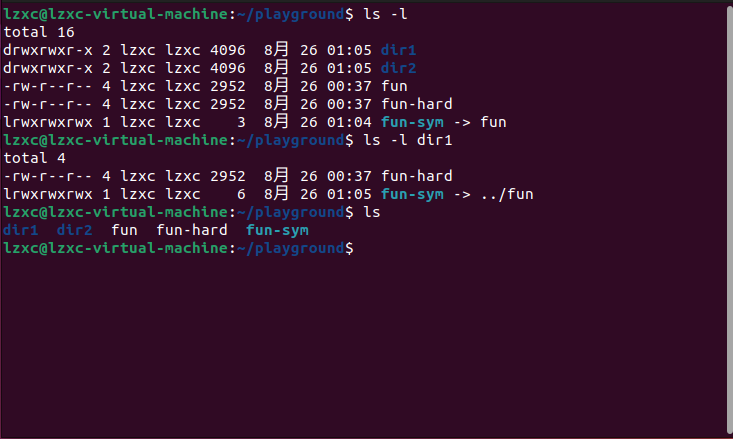

# 操作目录和文件

### 通配符
- 范例：
    |  模式   | 匹配对象  |
    |  :----:  | :----: |
    | *  | 所有文件 |
    | g*  | 文件名以“g”开头的文件 |
    | b*.txt|	以"b"开头，中间有零个或任意多个字符，并以".txt"结尾的文件|
    |Data???|	以“Data”开头，其后紧接着3个字符的文件|
    |[abc]*|	文件名以"a","b",或"c"开头的文件|
    |[[:upper:]]*	|以大写字母开头的文件|
    |*[[:lower:]123]|	文件名以小写字母结尾，或以 “1”，“2”，或 “3” 结尾的文件|
    |[![:digit:]]*	|不以数字开头的文件|

### 目录
- **mkdir** 创建目录  
    - mkdir dir1... （三个圆点跟在一个命令的参数后面， 这意味着那个参数可以跟多个）
            - mkdir dir1 dir2 dir3  
        
- **cp** 复制文件和目录  
    - **cp item1 item2**  
        复制单个文件或目录”item1”到文件或目录”item2”
    - **-a**, 复制文件和目录，以及它们的属性，包括拥有者和所有权  
    **-i** 提示用户确认  
    **-r** 递归复制目录及目录内容  
    **-u** 仅复制目标目录中不存在的文件  
    **-v** 显示操作信息
    - 示例：  
        - **cp dir1/\* dir2**	使用一个通配符，在目录 dir1 中的所有文件都被复制到目录 dir2 中。 dir2 必须已经存在。  
        - **cp file1 file2 dir1**	复制文件 file1 和文件 file2 到目录 dir1。目录 dir1 必须存在。
- **mv**    移动和重命名文件
    - **mv item1 item2**
    把文件或目录 “item1” 移动或重命名为 “item2”  
    - **mv item... directory**
    - -i, -u, -v参考cp

- **rm** 删除文件和目录
    - **rm item**
        - -i, -r, -v 参考cp
        - -f 忽视不存在的文件，不显示提示  
            例：**rm -rf file1 dir1**  
              删除file1和dir1，不管存不存在都执行

> Be Careful With rm!  
Linux没有复原命令。一旦你用 rm 删除了一些东西， 它就消失了。

- **ln**    创建链接（既可创建硬链接，也可以创建符号链接）
    - **ln file link**  创建硬链接  
        > 1. 一个硬链接不能关联它所在文件系统之外的文件。这是说一个链接不能关联与链接本身不在同一个磁盘分区上的文件。  
        > 2. 一个硬链接不能关联一个目录。   
    - **ln -s item link** 创建符号链接
        - 符号链接
            - 类似于windows快捷方式  
    
- 硬链接-符号链接 区别
    - 硬链接只是在文件系统中创建了一个额外的文件名，而不是创建了一个新的文件。当你创建一个硬链接时，操作系统只是在文件系统中添加了一个新的目录项，它指向相同的数据块和inode。
    - 符号链接实际上指的是路径名，若移动原文件，则不能通过符号链接打开

